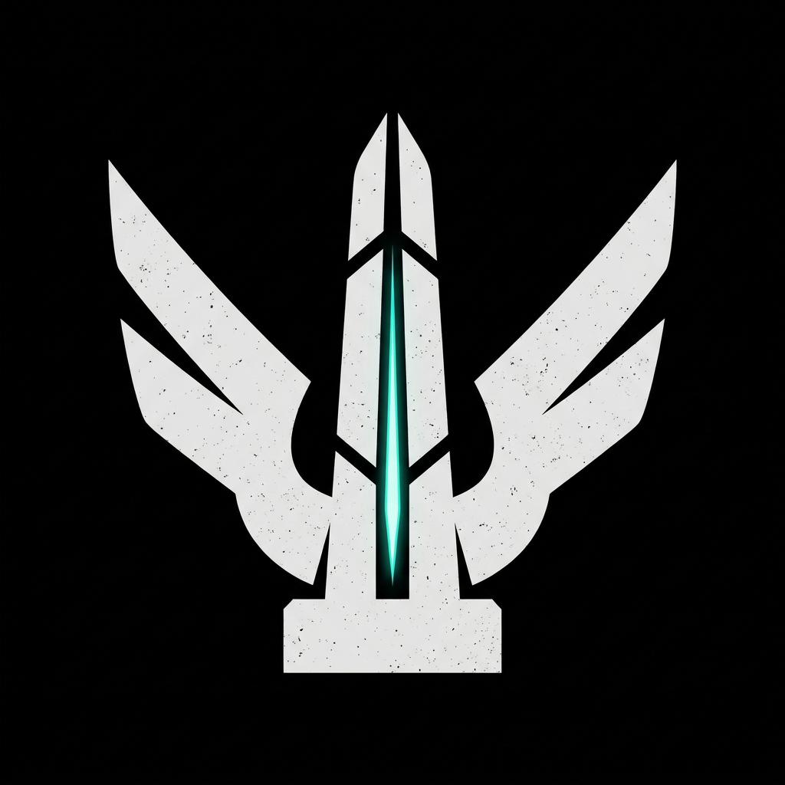

<div align="center">



# THE RISEN

**_Rise, Guardian._**

A first-person looter shooter set a century after the fall. The last Guardian wakes aboard the derelict starship _Vanguard_ and strikes out across **Earth, Mars, and Venus** to recover the Archive.


[](https://github.com/IBilba/The_Risen/releases/latest)
[](LICENSE.md)

### [⬇ Download &amp; Play (v1.0.0)](https://drive.google.com/file/d/1EfGOZ2w9beGJbHoXhAo3r7N8TEtCPOzt/view?usp=sharing) &nbsp;·&nbsp; [Releases](https://github.com/IBilba/The_Risen/releases) &nbsp;·&nbsp; [Planning repo](https://github.com/IBilba/game-dev-the-risen)

</div>

---

## Overview

**The Risen** is a solo-developed action-RPG looter shooter built in **Godot 4.7** (GDScript first, C# only where necessary). Sprint out from the starship hub into a mission, fight and loot, extract, then return to upgrade your gear at the vendor before the next drop. The core loop is loot-driven progression, class-based combat, and portal wave survival, capped by a multi-phase boss.

The art, audio, and cinematics are custom and largely **AI-generated through a fal.ai pipeline** (see [CREDITS.md](CREDITS.md)).

## Features

- **Three classes**, each with a passive and a unique Super - **Assault** (+10% damage), **Support** (+50 HP), **Tank** (-20% incoming). Every class shares a **Super / Grenade / Melee** ability axis.
- **Gunplay + loot** - four weapon types (Auto Rifle, Shotgun, Sniper, Hand Cannon), randomized loot in four rarities, **Flux** currency, and the **Forge Master** vendor for craftable mods.
- **Active shield** layered over health, pushing constant movement and resource management.
- **Difficulty tiers** - Normal / Heroic / Legendary with progression-based unlocks for better loot.
- **Space-travel hub** - pilot helm, hologram mission table, a swivelling cockpit, and cinematic **Fold** / **lift-off** transitions between hub and mission.
- **Intro cinematic** - a ~2-minute black-and-white "A Guardian Awakens" film on New Game.
- **Full framework** - 3-slot save system, settings (audio / graphics / controls), and a global pause menu.

## Missions

| Mission | Setting | Highlights |
| --- | --- | --- |
| **Earth** | Ruined city | Linear combat, mini-boss (Shielded Brute), the Archive Core objective |
| **Mars** | Underground facility | 5-wave **portal defense** (portals shift on waves 3 &amp; 5) + low-gravity platforming |
| **Venus** | Active volcano | Lava-hazard ascent culminating in the multi-phase **Ember Tyrant** boss |

## Controls

| Action | Input | Action | Input |
| --- | --- | --- | --- |
| Move | `W` `A` `S` `D` | Aim | Mouse |
| Jump | `Space` | Fire | Left click |
| Sprint | `Shift` | Reload | `R` |
| Select weapon | `1` `2` `3` | Swap weapon | Mouse wheel |
| Super | `Q` | Grenade | `G` |
| Melee | `V` | Inventory | `I` |
| Interact / Board | `E` | Pause | `Esc` |

Mouse sensitivity and invert-Y are configurable in **Settings → Controls**.

## Running the game

Download the packaged build from the [release](https://github.com/IBilba/The_Risen/releases/latest) (link above), unzip anywhere, and run **`The_Risen.exe`** (Windows 10/11, 64-bit). The game data is embedded in the executable, so there is no separate `.pck` and no installation. Save data and settings are written to `%APPDATA%\Godot\app_userdata\The Risen\`.

## Building from source

Open the project in **Godot 4.7** ("Import" → `project.godot`), or build the self-contained Windows `.exe`:

```powershell
powershell -ExecutionPolicy Bypass -File tools\build_windows.ps1
```

Full details, export-template setup, and troubleshooting: **[docs/BUILD_WINDOWS.md](docs/BUILD_WINDOWS.md)**.

## Project structure

```
The_Risen/
├── project.godot
├── scenes/      player · hub · missions (earth/mars/venus) · enemies · weapons
├── ui/          HUD, menus, vendor screens
├── scripts/     autoloads and shared systems (save, telemetry, ship travel)
└── assets/      art · audio · thirdparty and AI-generated imports
```

Naming follows the Godot style guide: `snake_case` files/folders, `PascalCase` node names and `class_name`s. Branches: `main` (stable) and `develop` (integration). An earlier Unreal Engine 5.8 prototype is preserved on the `archive/ue5-prototype` branch.

## Credits &amp; License

Third-party and AI-generated asset licenses are credited in [CREDITS.md](CREDITS.md) and in-game. This is a university course project made available for academic evaluation and educational reference only; all rights reserved. See [LICENSE.md](LICENSE.md).

Design documents, task backlog, and analysis tooling live in the companion planning repository: **[game-dev-the-risen](https://github.com/IBilba/game-dev-the-risen)**.
